# 画面構成図・画面遷移図

## 画面構成図

### 1. アプリケーション全体構成

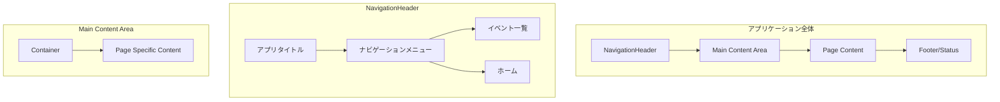

### 2. ホームページ構成

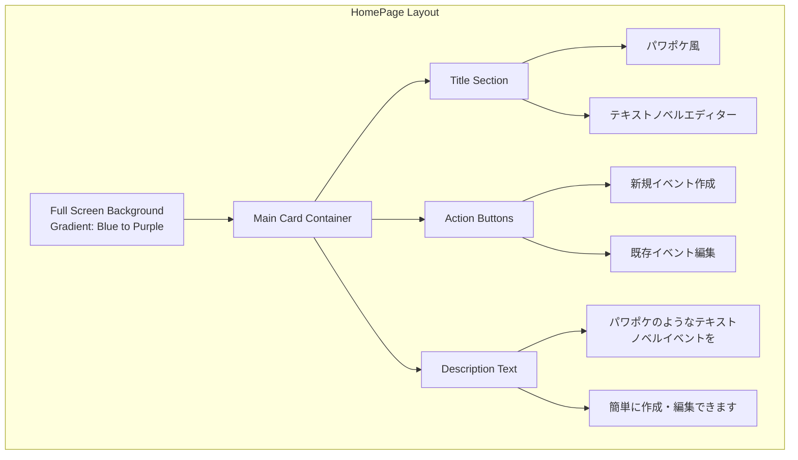

### 3. イベント一覧ページ構成

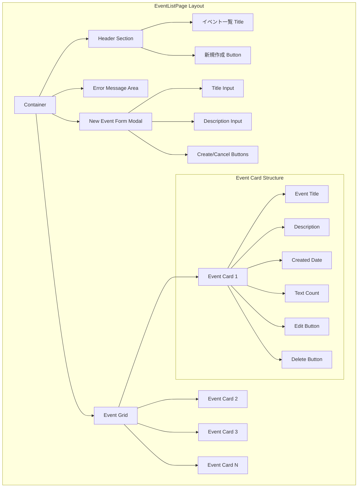

### 4. イベント編集ページ構成

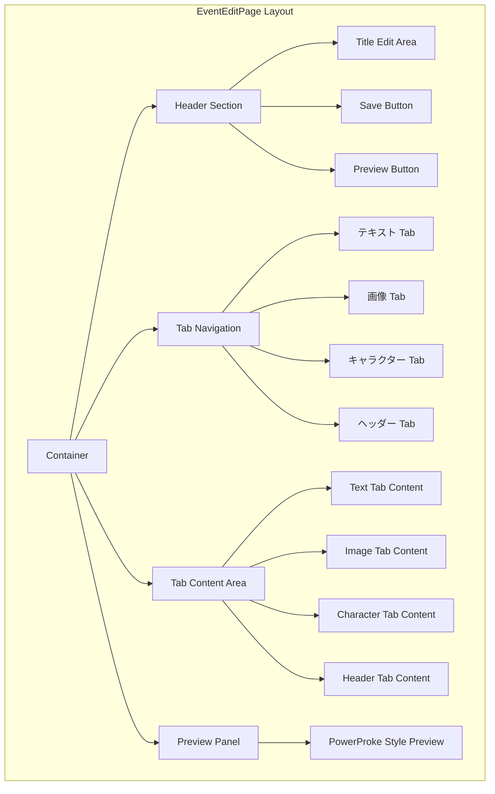

### 5. テキストタブ詳細構成

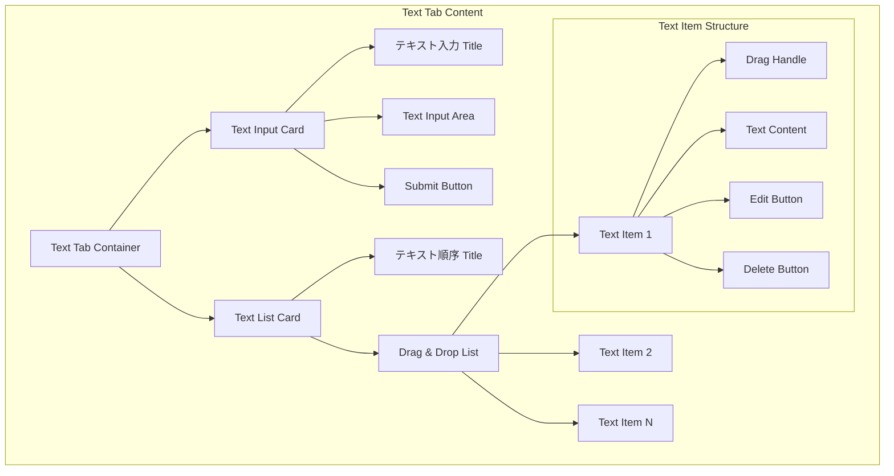

### 6. 画像タブ詳細構成

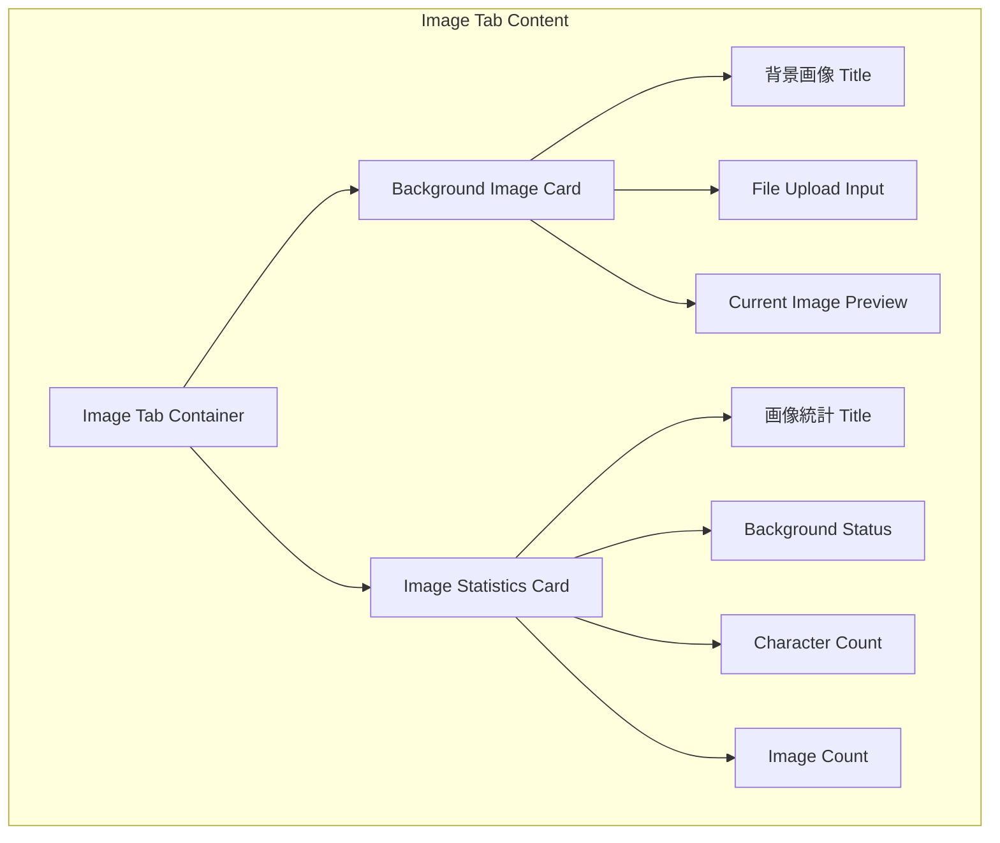

### 7. キャラクタータブ詳細構成

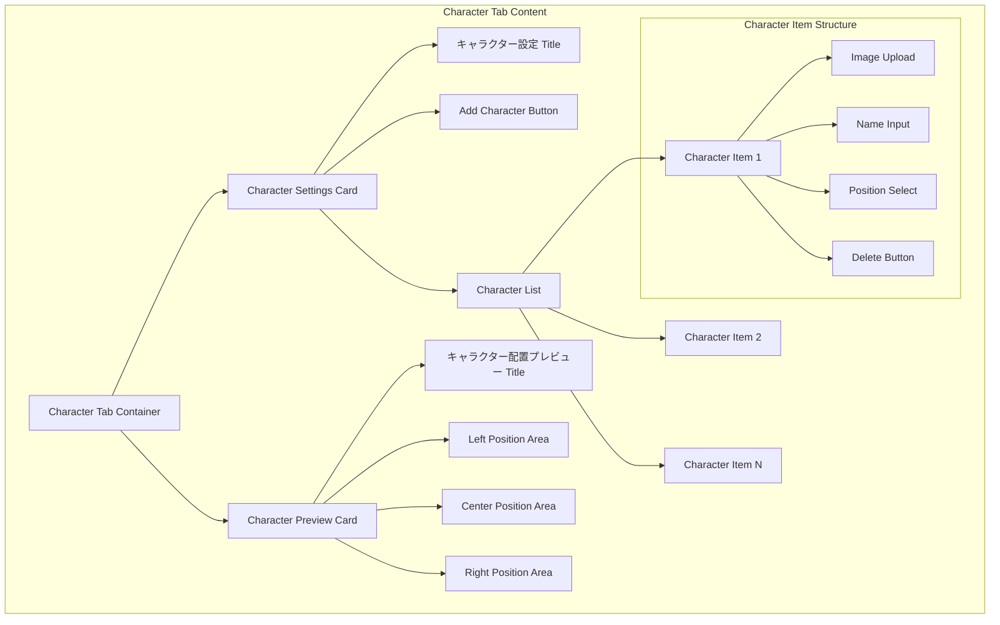

### 8. ヘッダータブ詳細構成

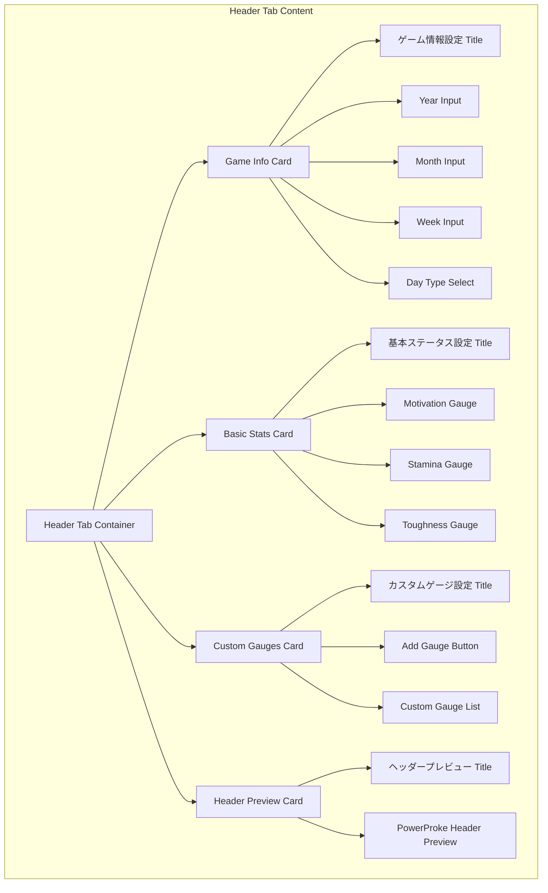

### 9. プレビューパネル詳細構成

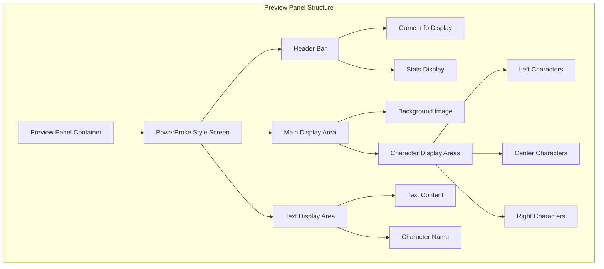

## 画面遷移図

### 1. 全体の画面遷移

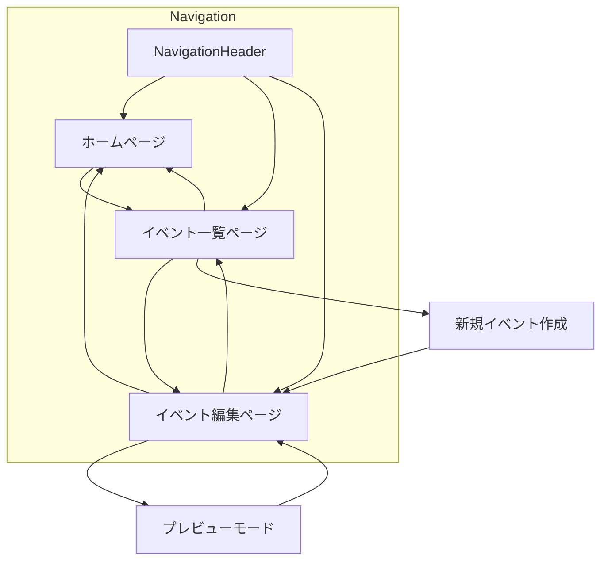

### 2. イベント一覧ページの遷移

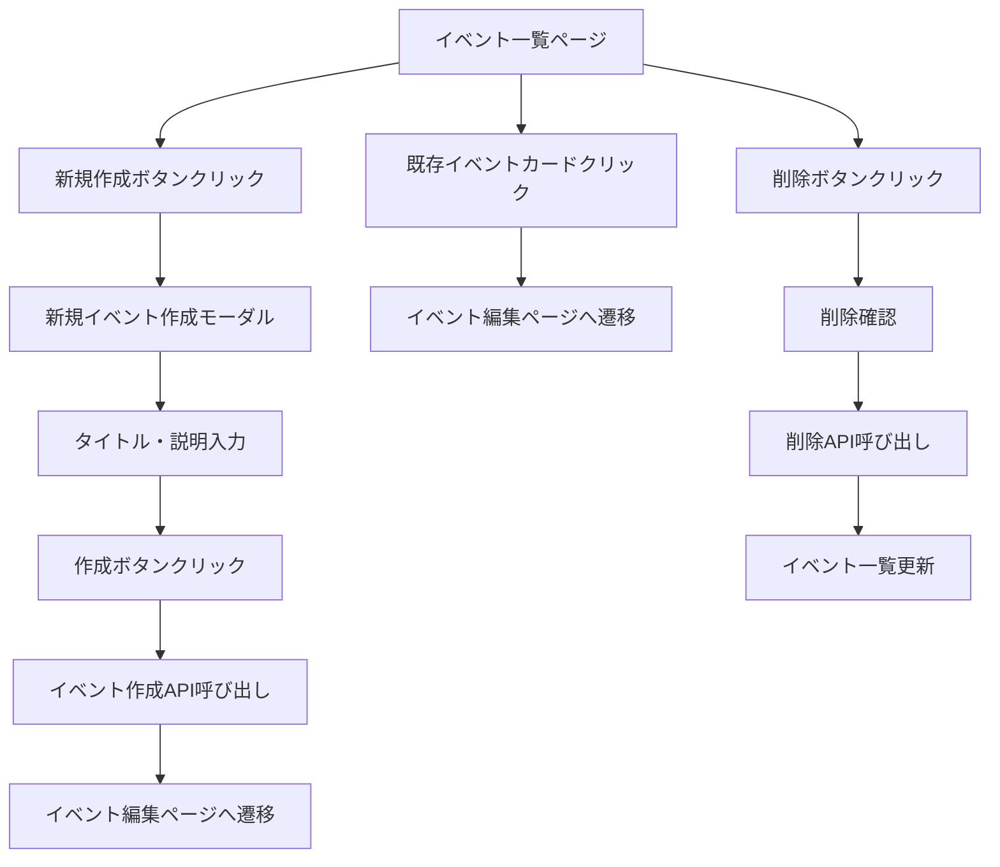

### 3. イベント編集ページの遷移

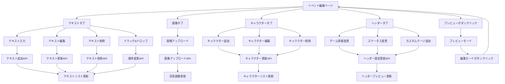

### 4. プレビューモードの遷移

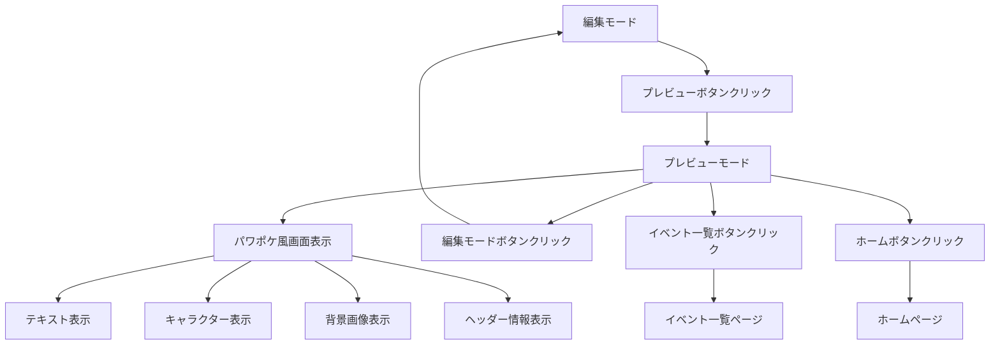

### 5. エラーハンドリングの遷移

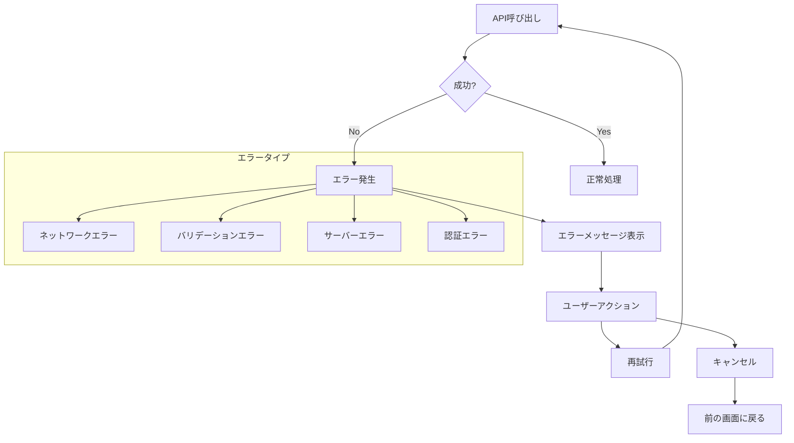

### 6. レスポンシブ対応の遷移

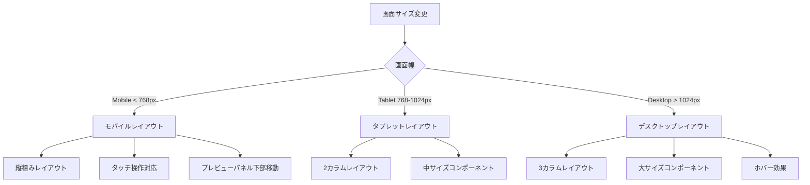

## 状態管理図

### 1. Redux Store構成

```mermaid
graph TB
    A[Redux Store] --> B[Events Slice]
    A --> C[Current Event Slice]
    A --> D[UI Slice]
    
    B --> B1[list: Event[]]
    B --> B2[loading: boolean]
    B --> B3[error: string]
    
    C --> C1[event: Event]
    C --> C2[loading: boolean]
    C --> C3[error: string]
    
    D --> D1[sidebarOpen: boolean]
    D --> D2[previewMode: boolean]
    D --> D3[dragIndex: number | null]
    
    subgraph "Local State (useState)"
        E[activeTab: string]
        F[isEditingTitle: boolean]
        G[hasUnsavedChanges: boolean]
    end
```

### 2. データフロー

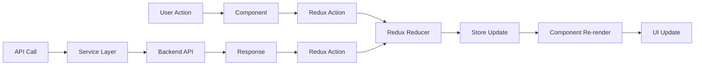

---

*このドキュメントは、アプリケーションの画面構成と画面遷移を詳細に説明しています。*
*最終更新: 2024年1月*
