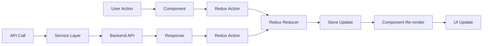

# UI設計ガイド

## 概要
パワポケ風テキストノベルイベント作成アプリの画面構成とUI設計について説明するドキュメントです。

## 全体の画面構成

### 1. アプリケーション全体のレイアウト

```
┌─────────────────────────────────────────────────────────────┐
│                    NavigationHeader                          │
│  [パワポケ風テキストノベルエディター] [イベント一覧] [ホーム] │
├─────────────────────────────────────────────────────────────┤
│                                                             │
│                    Main Content Area                        │
│                                                             │
│  ┌─────────────────────────────────────────────────────┐   │
│  │                Page Content                         │   │
│  │                                                     │   │
│  └─────────────────────────────────────────────────────┘   │
│                                                             │
└─────────────────────────────────────────────────────────────┘
```

### 2. ページ別の画面構成

## ホームページ (`HomePage`)

### レイアウト
```
┌─────────────────────────────────────────────────────────────┐
│                    NavigationHeader                          │
├─────────────────────────────────────────────────────────────┤
│                                                             │
│                    Full Screen Background                   │
│              (Gradient: powerproke-blue to purple)         │
│                                                             │
│                    ┌─────────────────┐                     │
│                    │   Main Card     │                     │
│                    │                 │                     │
│                    │  ┌───────────┐  │                     │
│                    │  │   タイトル  │  │                     │
│                    │  │ パワポケ風  │  │                     │
│                    │  │テキストノベル│  │                     │
│                    │  │  エディター  │  │                     │
│                    │  └───────────┘  │                     │
│                    │                 │                     │
│                    │  ┌───────────┐  │                     │
│                    │  │新規イベント│  │                     │
│                    │  │   作成     │  │                     │
│                    │  └───────────┘  │                     │
│                    │                 │                     │
│                    │  ┌───────────┐  │                     │
│                    │  │既存イベント│  │                     │
│                    │  │   編集     │  │                     │
│                    │  └───────────┘  │                     │
│                    │                 │                     │
│                    │  説明テキスト   │                     │
│                    └─────────────────┘                     │
│                                                             │
└─────────────────────────────────────────────────────────────┘
```

### スタイル特徴
- **背景**: グラデーション（powerproke-blue → powerproke-purple）
- **メインカード**: 白背景、角丸、影付き
- **ボタン**: powerproke-button クラス（青系グラデーション）
- **フォント**: font-game クラス（ゲーム風フォント）

## イベント一覧ページ (`EventListPage`)

### レイアウト
```
┌─────────────────────────────────────────────────────────────┐
│                    NavigationHeader                          │
├─────────────────────────────────────────────────────────────┤
│                                                             │
│  ┌─────────────────────────────────────────────────────┐   │
│  │ Container (mx-auto px-4 py-8)                     │   │
│  │                                                     │   │
│  │ ┌─────────────────────────────────────────────┐   │   │
│  │ │ Header Section                              │   │   │
│  │ │ [イベント一覧]                    [新規作成] │   │   │
│  │ └─────────────────────────────────────────────┘   │   │
│  │                                                     │   │
│  │ ┌─────────────────────────────────────────────┐   │   │
│  │ │ Event List Grid                            │   │   │
│  │ │ ┌─────┐ ┌─────┐ ┌─────┐ ┌─────┐           │   │   │
│  │ │ │Event│ │Event│ │Event│ │Event│           │   │   │
│  │ │ │  1  │ │  2  │ │  3  │ │  4  │           │   │   │
│  │ │ └─────┘ └─────┘ └─────┘ └─────┘           │   │   │
│  │ └─────────────────────────────────────────────┘   │   │
│  │                                                     │   │
│  └─────────────────────────────────────────────────────┘   │
│                                                             │
└─────────────────────────────────────────────────────────────┘
```

### イベントカードの構成
```
┌─────────────────────────────────────┐
│ Event Card                          │
│ ┌─────────────────────────────────┐ │
│ │ Event Title                    │ │
│ └─────────────────────────────────┘ │
│ ┌─────────────────────────────────┐ │
│ │ Description                    │ │
│ └─────────────────────────────────┘ │
│ ┌─────────────────────────────────┐ │
│ │ Created: 2024-01-01 12:00      │ │
│ │ Texts: 5件                     │ │
│ └─────────────────────────────────┘ │
│ ┌─────────────────────────────────┐ │
│ │ [編集] [削除]                   │ │
│ └─────────────────────────────────┘ │
└─────────────────────────────────────┘
```

## イベント編集ページ (`EventEditPage`)

### レイアウト
```
┌─────────────────────────────────────────────────────────────┐
│                    NavigationHeader                          │
├─────────────────────────────────────────────────────────────┤
│                                                             │
│  ┌─────────────────────────────────────────────────────┐   │
│  │ Container (mx-auto px-4 py-8)                     │   │
│  │                                                     │   │
│  │ ┌─────────────────────────────────────────────┐   │   │
│  │ │ Header Section                              │   │   │
│  │ │ [イベントタイトル編集] [保存] [プレビュー]   │   │   │
│  │ └─────────────────────────────────────────────┘   │   │
│  │                                                     │   │
│  │ ┌─────────────────────────────────────────────┐   │   │
│  │ │ Tab Navigation                              │   │   │
│  │ │ [テキスト] [画像] [キャラクター] [ヘッダー] │   │   │
│  │ └─────────────────────────────────────────────┘   │   │
│  │                                                     │   │
│  │ ┌─────────────────────────────────────────────┐   │   │
│  │ │ Tab Content Area                           │   │   │
│  │ │                                             │   │   │
│  │ │ (選択されたタブの内容が表示される)          │   │   │
│  │ │                                             │   │   │
│  │ └─────────────────────────────────────────────┘   │   │
│  │                                                     │   │
│  │ ┌─────────────────────────────────────────────┐   │   │
│  │ │ Preview Panel                              │   │   │
│  │ │ (パワポケ風プレビュー)                     │   │   │
│  │ └─────────────────────────────────────────────┘   │   │
│  │                                                     │   │
│  └─────────────────────────────────────────────────────┘   │
│                                                             │
└─────────────────────────────────────────────────────────────┘
```

### タブ別の詳細構成

#### テキストタブ
```
┌─────────────────────────────────────────────────────────────┐
│ Text Tab Content                                           │
│                                                             │
│ ┌─────────────────────────────────────────────────────┐   │
│ │ Text Input Card                                    │   │
│ │ ┌─────────────────────────────────────────────────┐ │   │
│ │ │ テキスト入力                                    │ │   │
│ │ │ ┌─────────────────────────────────────────────┐ │ │   │
│ │ │ │ [テキスト入力エリア]                        │ │ │   │
│ │ │ └─────────────────────────────────────────────┘ │ │   │
│ │ └─────────────────────────────────────────────────┘ │   │
│ └─────────────────────────────────────────────────────┘   │
│                                                             │
│ ┌─────────────────────────────────────────────────────┐   │
│ │ Text List Card                                      │   │
│ │ ┌─────────────────────────────────────────────────┐ │   │
│ │ │ テキスト順序 (5件)                              │ │   │
│ │ │ ┌─────────────────────────────────────────────┐ │ │   │
│ │ │ │ [Drag Handle] Text Item 1        [編集][削除]│ │ │   │
│ │ │ └─────────────────────────────────────────────┘ │ │   │
│ │ │ ┌─────────────────────────────────────────────┐ │ │   │
│ │ │ │ [Drag Handle] Text Item 2        [編集][削除]│ │ │   │
│ │ │ └─────────────────────────────────────────────┘ │ │   │
│ │ └─────────────────────────────────────────────────┘ │   │
│ └─────────────────────────────────────────────────────┘   │
└─────────────────────────────────────────────────────────────┘
```

#### 画像・キャラクタータブ（統合）
```
┌─────────────────────────────────────────────────────────────┐
│ Image & Character Tab Content                              │
│                                                             │
│ ┌─────────────────────────────────────────────────────┐   │
│ │ Background Image Card                              │   │
│ │ ┌─────────────────────────────────────────────────┐ │   │
│ │ │ 背景画像設定                                    │ │   │
│ │ │ ┌─────────────────────────────────────────────┐ │ │   │
│ │ │ │ [ファイル選択]                              │ │ │   │
│ │ │ └─────────────────────────────────────────────┘ │ │   │
│ │ │ ┌─────────────────────────────────────────────┐ │ │   │
│ │ │ │ [現在の背景画像プレビュー]                  │ │ │   │
│ │ │ └─────────────────────────────────────────────┘ │ │   │
│ │ └─────────────────────────────────────────────────┘ │   │
│ └─────────────────────────────────────────────────────┘   │
│                                                             │
│ ┌─────────────────────────────────────────────────────┐   │
│ │ Character Settings Card                            │   │
│ │ ┌─────────────────────────────────────────────────┐ │   │
│ │ │ キャラクター設定 (3体)              [追加]     │ │   │
│ │ │                                                 │ │   │
│ │ │ ┌─────────────────────────────────────────────┐ │ │   │
│ │ │ │ Character Item 1                            │ │ │   │
│ │ │ │ ┌─────────┐ ┌─────────┐ ┌─────────┐        │ │ │   │
│ │ │ │ │画像設定 │ │名前設定 │ │位置設定 │        │ │ │   │
│ │ │ │ │(正方形) │ │         │ │         │        │ │ │   │
│ │ │ │ └─────────┘ └─────────┘ └─────────┘        │ │ │   │
│ │ │ └─────────────────────────────────────────────┘ │ │   │
│ │ └─────────────────────────────────────────────────┘ │   │
│ └─────────────────────────────────────────────────────┘   │
│                                                             │
│ ┌─────────────────────────────────────────────────────┐   │
│ │ Integrated Preview Card                             │   │
│ │ ┌─────────────────────────────────────────────────┐ │   │
│ │ │ 背景画像・キャラクター配置プレビュー            │ │   │
│ │ │ ┌─────────────────────────────────────────────┐ │ │   │
│ │ │ │ [背景画像 + キャラクター配置]               │ │ │   │
│ │ │ │ 統合プレビュー表示                          │ │ │   │
│ │ │ └─────────────────────────────────────────────┘ │ │   │
│ │ └─────────────────────────────────────────────────┘ │   │
│ └─────────────────────────────────────────────────────┘   │
└─────────────────────────────────────────────────────────────┘
```


#### ヘッダータブ
```
┌─────────────────────────────────────────────────────────────┐
│ Header Tab Content                                         │
│                                                             │
│ ┌─────────────────────────────────────────────────────┐   │
│ │ Game Info Card                                    │   │
│ │ ┌─────────────────────────────────────────────────┐ │   │
│ │ │ ゲーム情報設定                                  │ │   │
│ │ │ ┌─────┐ ┌─────┐ ┌─────┐ ┌─────┐               │ │   │
│ │ │ │ 年  │ │ 月  │ │ 週  │ │曜日 │               │ │   │
│ │ │ └─────┘ └─────┘ └─────┘ └─────┘               │ │   │
│ │ └─────────────────────────────────────────────────┘ │   │
│ └─────────────────────────────────────────────────────┘   │
│                                                             │
│ ┌─────────────────────────────────────────────────────┐   │
│ │ Basic Stats Card                                   │   │
│ │ ┌─────────────────────────────────────────────────┐ │   │
│ │ │ 基本ステータス設定                               │ │   │
│ │ │ ┌─────────────────────────────────────────────┐ │ │   │
│ │ │ │ やる気: 😊 3/5 [ゲージバー]                 │ │ │   │
│ │ │ └─────────────────────────────────────────────┘ │ │   │
│ │ │ ┌─────────────────────────────────────────────┐ │ │   │
│ │ │ │ 体力: ❤️ 5/5 [ゲージバー]                   │ │ │   │
│ │ │ └─────────────────────────────────────────────┘ │ │   │
│ │ │ ┌─────────────────────────────────────────────┐ │ │   │
│ │ │ │ タフ: 💚 2/5 [ゲージバー]                  │ │ │   │
│ │ │ └─────────────────────────────────────────────┘ │ │   │
│ │ └─────────────────────────────────────────────────┘ │   │
│ └─────────────────────────────────────────────────────┘   │
│                                                             │
│                                                             │
│ ┌─────────────────────────────────────────────────────┐   │
│ │ Header Preview Card                                 │   │
│ │ ┌─────────────────────────────────────────────────┐ │   │
│ │ │ ヘッダープレビュー                              │ │   │
│ │ │ ┌─────────────────────────────────────────────┐ │ │   │
│ │ │ │ 1年目 6月3週 平日 やる気:😊😊😊 体力:❤️❤️❤️❤️❤️ タフ:💚💚│ │ │   │
│ │ │ └─────────────────────────────────────────────┘ │ │   │
│ │ └─────────────────────────────────────────────────┘ │   │
│ └─────────────────────────────────────────────────────┘   │
└─────────────────────────────────────────────────────────────┘
```

## プレビューパネル (`PreviewPanel`)

### レイアウト
```
┌─────────────────────────────────────────────────────────────┐
│ Preview Panel                                              │
│                                                             │
│ ┌─────────────────────────────────────────────────────┐   │
│ │ パワポケ風プレビュー                                │   │
│ │                                                     │   │
│ │ ┌─────────────────────────────────────────────────┐ │   │
│ │ │ PowerProke Style Screen                         │ │   │
│ │ │ ┌─────────────────────────────────────────────┐ │ │   │
│ │ │ │ Header Bar                                   │ │ │   │
│ │ │ │ 1年目 6月3週 平日 やる気:😊😊😊 体力:❤️❤️❤️❤️❤️ タフ:💚💚│ │ │   │
│ │ │ └─────────────────────────────────────────────┘ │ │   │
│ │ │                                                 │ │   │
│ │ │ ┌─────────────────────────────────────────────┐ │ │   │
│ │ │ │ Main Display Area                          │ │ │   │
│ │ │ │ ┌─────┐                     ┌─────┐        │ │ │   │
│ │ │ │ │左側 │                     │右側 │        │ │ │   │
│ │ │ │ │キャラ│                     │キャラ│        │ │ │   │
│ │ │ │ └─────┘                     └─────┘        │ │ │   │
│ │ │ │                                             │ │ │   │
│ │ │ │ ┌─────────────────────────────────────────┐ │ │ │   │
│ │ │ │ │ Text Display Area                       │ │ │ │   │
│ │ │ │ │ テキストがここに表示される               │ │ │ │   │
│ │ │ │ └─────────────────────────────────────────┘ │ │ │   │
│ │ │ └─────────────────────────────────────────────┘ │ │   │
│ │ └─────────────────────────────────────────────────┘ │   │
│ └─────────────────────────────────────────────────────┘   │
└─────────────────────────────────────────────────────────────┘
```

## 共通UIコンポーネント

### 1. カードコンポーネント (`powerproke-card`)
```css
.powerproke-card {
  @apply bg-white rounded-lg shadow-md p-6 border border-gray-200;
}
```

### 2. ボタンコンポーネント (`powerproke-button`)
```css
.powerproke-button {
  @apply bg-gradient-to-r from-blue-500 to-purple-600 text-white font-bold py-2 px-4 rounded hover:from-blue-600 hover:to-purple-700 transition-all duration-200 shadow-md;
}
```

### 3. 入力フィールドコンポーネント (`powerproke-input`)
```css
.powerproke-input {
  @apply w-full px-3 py-2 border border-gray-300 rounded-md focus:outline-none focus:ring-2 focus:ring-blue-500 focus:border-transparent;
}
```

### 4. ゲーム風フォント (`font-game`)
```css
.font-game {
  font-family: 'Noto Sans JP', sans-serif;
  font-weight: 700;
  letter-spacing: 0.05em;
}
```

## レスポンシブデザイン

### ブレークポイント
- **Mobile**: < 768px
- **Tablet**: 768px - 1024px
- **Desktop**: > 1024px

### レスポンシブ対応例

#### イベント編集ページ
- **Mobile**: タブが縦積み、プレビューパネルが下部に移動
- **Tablet**: 2カラムレイアウト
- **Desktop**: 3カラムレイアウト（タブ、コンテンツ、プレビュー）

#### キャラクター設定
- **Mobile**: グリッドが1カラム
- **Tablet**: グリッドが2カラム
- **Desktop**: グリッドが3カラム

## カラーパレット

### メインカラー
- **Primary Blue**: `#3B82F6` (blue-500)
- **Primary Purple**: `#8B5CF6` (purple-500)
- **PowerProke Blue**: `#1E40AF` (blue-800)
- **PowerProke Purple**: `#7C3AED` (purple-600)

### セカンダリカラー
- **Success**: `#10B981` (emerald-500)
- **Warning**: `#F59E0B` (amber-500)
- **Error**: `#EF4444` (red-500)
- **Info**: `#3B82F6` (blue-500)

### ニュートラルカラー
- **Gray 50**: `#F9FAFB`
- **Gray 100**: `#F3F4F6`
- **Gray 200**: `#E5E7EB`
- **Gray 300**: `#D1D5DB`
- **Gray 400**: `#9CA3AF`
- **Gray 500**: `#6B7280`
- **Gray 600**: `#4B5563`
- **Gray 700**: `#374151`
- **Gray 800**: `#1F2937`
- **Gray 900**: `#111827`

## アニメーション

### トランジション
- **Duration**: 200ms
- **Easing**: ease-in-out
- **Hover Effects**: scale, shadow, color changes

### ローディング状態
- **Spinner**: 回転アニメーション
- **Skeleton**: パルスアニメーション
- **Progress Bar**: プログレスバーアニメーション

## アクセシビリティ

### キーボードナビゲーション
- **Tab Order**: 論理的な順序
- **Focus Indicators**: 明確なフォーカス表示
- **Keyboard Shortcuts**: 主要機能のショートカット

### スクリーンリーダー対応
- **ARIA Labels**: 適切なラベル設定
- **Semantic HTML**: 意味のあるHTML構造
- **Alt Text**: 画像の代替テキスト

## 状態管理

### Redux Store構成

```mermaid
graph TB
    A[Redux Store] --> B[Events Slice]
    A --> C[Current Event Slice]
    A --> D[UI Slice]
    
    B --> B1[list: Event[]]
    B --> B2[loading: boolean]
    B --> B3[error: string]
    
    C --> C1[event: Event]
    C --> C2[loading: boolean]
    C --> C3[error: string]
    
    D --> D1[sidebarOpen: boolean]
    D --> D2[previewMode: boolean]
    D --> D3[dragIndex: number | null]
    
    subgraph "Local State (useState)"
        E[activeTab: string]
        F[isEditingTitle: boolean]
        G[hasUnsavedChanges: boolean]
    end
```

### データフロー



## 今後の拡張予定

### 追加予定のUI要素
1. **モーダルダイアログ**: 確認ダイアログ、設定ダイアログ
2. **トースト通知**: 成功・エラーメッセージ
3. **ドロップダウンメニュー**: コンテキストメニュー
4. **ツールチップ**: ヘルプテキスト表示
5. **プログレスバー**: アップロード進捗表示

### テーマ機能
1. **ダークモード**: ダークテーマ対応
2. **カスタムテーマ**: ユーザー定義カラー
3. **フォントサイズ調整**: アクセシビリティ対応

---

*このドキュメントは、アプリケーションのUI設計と画面構成を詳細に説明しています。*
*最終更新: 2024年1月*
